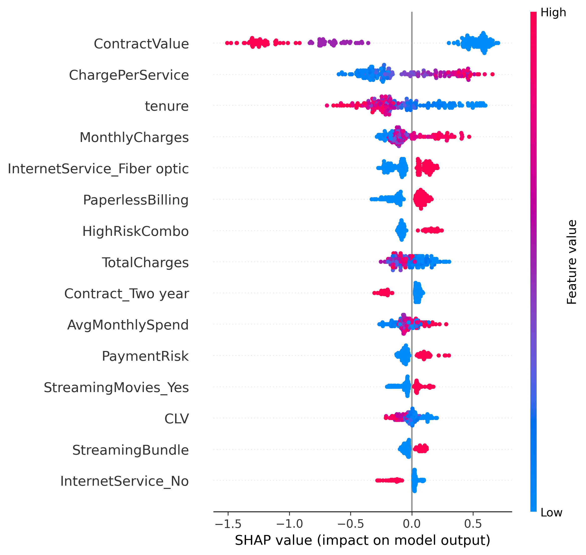

# Customer Churn Prediction + AI-Powered Retention

An end-to-end machine learning system that predicts customer churn 30 days in advance and generates personalized retention emails using GenAI + RAG.


---

## Metrics

| Metric | Value |
|--------|-------|
| AUC Score | **0.848** |
| Precision (Churn) | **66%** |
| Recall (Churn) | **54%** |
| Cross-Validation AUC | **0.836 (+/- 0.010)** |
| Engineered Features | **17** |
| Total Features | **45** |

---

## Architecture

```
┌─────────────────────────────────────────────────────────────────┐
│                   STREAMLIT DASHBOARD (UI)                      │
│  ┌──────────────┐  ┌──────────────┐  ┌───────────────────┐    │
│  │ Upload CSV   │  │ View Top 20  │  │ Generate Email    │    │
│  │ Data         │  │ At-Risk      │  │ Campaign          │    │
│  └──────────────┘  └──────────────┘  └───────────────────┘    │
└────────────┬────────────────────────────────────────┬──────────┘
             │                                        │
    ┌────────▼─────────┐                    ┌────────▼──────────┐
    │  CHURN MODEL     │                    │  RETENTION AGENT  │
    │  (XGBoost)       │                    │  (Gemini + RAG)   │
    │                  │                    │                   │
    │  - 45 Features   │                    │  - Prompt Engine  │
    │  - Prediction    │                    │  - Context Inject │
    │  - SHAP Values   │                    │  - Email Generate │
    └────────┬─────────┘                    └────────┬──────────┘
             │                                        │
    ┌────────▼─────────┐                    ┌────────▼──────────┐
    │  FEATURE ENG     │                    │  VECTOR DB        │
    │                  │                    │  (ChromaDB)       │
    │  - CLV           │                    │                   │
    │  - ServiceCount  │                    │  - 500 Customer   │
    │  - HighRiskCombo │                    │    Histories      │
    │  - 14 more...    │                    │  - Embeddings     │
    └──────────────────┘                    └───────────────────┘
```

## Features

- **Churn Prediction** — XGBoost classifier identifies at-risk customers with 0.848 AUC
- **17 Engineered Features** — CLV, ServiceCount, HighRiskCombo, ChargePerService, IsNewCustomer, and more
- **SHAP Explainability** — Understand which features drive each prediction
- **RAG-Powered Email Generation** — ChromaDB retrieves customer history, Gemini crafts personalized retention emails
- **Dynamic Discount Calculation** — 10-30% discounts based on CLV and churn probability
- **Interactive Dashboard** — Streamlit UI with risk charts, customer tables, and one-click email generation

---

## Project Structure

```
customer-churn-prediction_final/
├── app/
│   └── dashboard.py                # Streamlit dashboard (3 tabs)
├── src/
│   ├── preprocess.py               # Data cleaning + encoding
│   ├── feature_engineering.py      # 17 engineered features
│   ├── train_model.py              # XGBoost training pipeline
│   ├── explain_model.py            # SHAP explainability
│   ├── generate_customer_history.py # Simulated interaction data
│   ├── setup_rag.py                # ChromaDB vector store setup
│   └── retention_agent.py          # Gemini + RAG email generator
├── config/
│   └── settings.py                 # Centralized configuration
├── data/                           # Dataset + customer histories
├── models/                         # Trained model artifacts (.pkl)
├── reports/                        # SHAP summary plot
├── chroma_db/                      # ChromaDB vector database
├── requirements.txt
├── .env.example
└── .gitignore
```

---

## Tech Stack

| Component | Technology |
|-----------|-----------|
| ML Model | XGBoost, Scikit-learn |
| Feature Engineering | Pandas, NumPy |
| GenAI | Google Gemini 2.0 Flash |
| RAG | LangChain, ChromaDB |
| Explainability | SHAP |
| Dashboard | Streamlit, Plotly |
| Data | Telco Customer Churn (7,043 customers) |

---

## Installation

### Prerequisites
- [Anaconda](https://www.anaconda.com/download) or Miniconda
- [Google Gemini API Key](https://makersuite.google.com/app/apikey) (free tier)

### Setup

```bash
# 1. Clone the repository
git clone https://github.com/<your-username>/customer-churn-prediction.git
cd customer-churn-prediction

# 2. Create conda environment
conda create -n churn-prediction python=3.11 -y
conda activate churn-prediction

# 3. Install dependencies
pip install -r requirements.txt

# 4. Configure API key
cp .env.example .env
# Edit .env and add your GOOGLE_API_KEY

# 5. Download dataset
# Get it from: https://www.kaggle.com/datasets/blastchar/telco-customer-churn
# Place WA_Fn-UseC_-Telco-Customer-Churn.csv in the data/ folder
```

### Build Pipeline

Run these in order:

```bash
# Train the churn model
python src/train_model.py

# Generate SHAP explanations
python src/explain_model.py

# Generate simulated customer histories
python src/generate_customer_history.py

# Load histories into ChromaDB
python src/setup_rag.py

# Launch the dashboard
streamlit run app/dashboard.py
```

---

## Usage

### Dashboard

Open http://localhost:8501 after launching Streamlit.

**Tab 1 — Dashboard:**
- Toggle "Use Demo Data" in the sidebar (or upload your own CSV)
- View churn probability distribution and risk level breakdown
- See the top 20 at-risk customers ranked by churn probability
- Download full prediction results as CSV

**Tab 2 — Retention Emails:**
- Select a high-risk customer from the dropdown
- Click "Generate Email" to create a personalized retention email
- The AI references real customer interaction history via RAG
- Dynamic discount (10-30%) is calculated based on CLV and risk score

**Tab 3 — Model Insights:**
- View top 15 feature importance chart
- Check model performance metrics (AUC, Precision, Recall)
- Toggle SHAP summary plot for feature-level explanations

### Standalone Scripts

```bash
# Test the retention agent directly
python src/retention_agent.py

# Retrain the model (after modifying hyperparameters in config/settings.py)
python src/train_model.py
```

---

## How It Works

### 1. Feature Engineering

17 custom features are engineered from the raw telco data:

| Feature | Description |
|---------|-------------|
| `CLV` | Customer Lifetime Value (tenure x monthly charges) |
| `AvgMonthlySpend` | Total charges normalized by tenure |
| `ServiceCount` | Number of active service subscriptions |
| `ContractValue` | Contract commitment score (1-3) |
| `PaymentRisk` | Electronic check payment flag |
| `HighRiskCombo` | Month-to-month contract + electronic check |
| `ChargePerService` | Cost efficiency ratio |
| `IsNewCustomer` | Tenure <= 6 months flag |
| `HasFamily` | Partner or dependents indicator |
| `NoProtection` | Missing all protection services |
| `StreamingBundle` | Both streaming services active |
| + 6 more | SeniorHighSpend, NoTechSupport, NoOnlineSecurity, etc. |

### 2. Dynamic Discount Strategy

| CLV | Churn Probability | Discount |
|-----|-------------------|----------|
| > $2,000 | > 70% | 30% |
| > $1,000 | > 60% | 20% |
| Any | > 50% | 15% |
| Default | Any | 10% |

### 3. RAG Pipeline

1. Customer interaction histories are embedded and stored in ChromaDB
2. When generating an email, the customer's history is retrieved by ID
3. History + customer metrics + discount are injected into a structured prompt
4. Gemini 2.0 Flash generates a warm, personalized 150-200 word email

---

## SHAP Feature Importance



Key insights:
- **ContractValue** is the strongest predictor — month-to-month contracts drive churn
- **ChargePerService** and **tenure** are the next most impactful features
- **Fiber optic internet** customers churn more than DSL users
- **HighRiskCombo** (month-to-month + electronic check) is a strong churn signal

---

## Configuration

All hyperparameters and settings are centralized in [`config/settings.py`](config/settings.py):

```python
# Model hyperparameters
MODEL_PARAMS = {
    "n_estimators": 300,
    "max_depth": 5,
    "learning_rate": 0.05,
    ...
}

# Gemini settings
GEMINI_MODEL = "gemini-2.0-flash"
GEMINI_TEMPERATURE = 0.7
```

---

## Dataset

[Telco Customer Churn](https://www.kaggle.com/datasets/blastchar/telco-customer-churn) — IBM sample dataset

- **7,043 customers**, 21 attributes
- **26.5% churn rate**
- Features: demographics, service subscriptions, account info, contract type
- Target: `Churn` (Yes/No)


